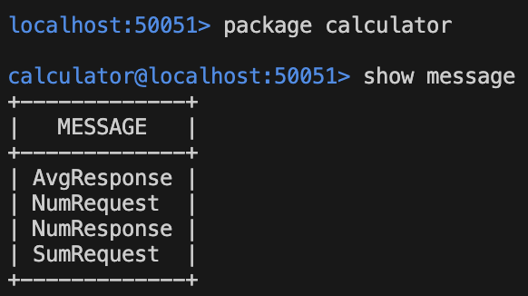

# gRPC 
----

## How to use
### Manual Code Generation
```protoc -Igreet/proto --go_out=. --go_opt=module=github.com/MartinLupa/gRPC --go-grpc_out=. --go-grpc_opt=module=github.com/MartinLupa/gRPC greet/proto/dummy.proto```

Explanation of command flags:

- ```-Igreet/proto```: -I/<path> indicates where the input file is.

- ```--go_out=.``` and ```--go-grpc_out=.```: indicate that we want to generate the code in the current directory. But will be influenced by ```--go_opt``` and ```--go-grpc_opt```.

- ```--go_opt=module=github.com/MartinLupa/gRPC``` and ```--go-grpc_opt=module=github.com/MartinLupa/gRPC```: we are indicating that our module is called "github.com/MartinLupa/gRPC", so the command will remove this part of the string from the go_package(originally "github.com/MartinLupa/gRPC/greet/proto") and will leave only "./greet/proto", so the output of the command will be available in such path of ./greet/proto.

- ```greet/proto/dummy.proto```: indicates where the .proto file is located.

### Code Generation with Makefile

- ```make <project_name>```: to generate the code out of the .proto file.
- ```make help```: to see all available options.


### Running client and server

- open one terminal and run ```./bin/<project_name>/server```
- open a second terminal and run ```./bin/<project_name>/client```


## Projects

Check the README.md file inside each project to learn how to use it.

### greet(Greet) and calculator(Sum): gRPC Unary API

Simple greeting and calculator gRPC Unary API.

[greet: gRPC Unary README.md](./greet/README.md)

[calculator: gRPC Unary README.md](./calculator/README.md)

### greet(GreetManyTimes) and calculator(Primes): gRPC Server Streaming API

The GreetService and CalculatorService are modified by adding function calls that support streams on the server.

### greet(LongGreet) and calculator(Avg): gRPC Client Streaming API

The GreetService and CalculatorService are modified by adding function calls that support streams on the client.


### greet(GreetEveryone) and calculator(Max): gRPC Bi-Directional Streaming API

The GreetService and CalculatorService are modified by adding function calls that support streams on the client.

## Other features

- GreetWithDeadline: includes waiting timeouts for responses.
- Greet server/client: SSL Security.
- Reflection & Evans CLI: to visualize services and endpoints. 

### Running evans CLI (visualize and test packages, services, messages, and endpoints): 
- Install evans CLI from https://github.com/ktr0731/evans
- ```evans --host localhost --port 50051 --reflection repl```

```show package```


```show message```



```package calculator & show service```


```call Sum (testing Sum endpoint)```


